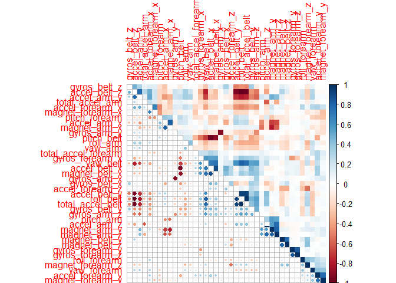

Prediction Assignment
=====================

Background
----------

Using devices such as Jawbone Up, Nike FuelBand, and Fitbit it is now
possible to collect a large amount of data about personal activity
relatively inexpensively. These type of devices are part of the
quantified self movement - a group of enthusiasts who take measurements
about themselves regularly to improve their health, to find patterns in
their behavior, or because they are tech geeks. One thing that people
regularly do is quantify how much of a particular activity they do, but
they rarely quantify how well they do it. In this project, your goal
will be to use data from accelerometers on the belt, forearm, arm, and
dumbell of 6 participants. They were asked to perform barbell lifts
correctly and incorrectly in 5 different ways. More information is
available from the website here:
<http://groupware.les.inf.puc-rio.br/har> (see the section on the Weight
Lifting Exercise Dataset).

Preparing the data
------------------

### Downloading and loading data

    download.file('https://d396qusza40orc.cloudfront.net/predmachlearn/pml-training.csv','pml-training.csv' )
    download.file('https://d396qusza40orc.cloudfront.net/predmachlearn/pml-testing.csv','pml-testing.csv')

    training <- read.csv('pml-training.csv',
                         header = TRUE,
                         sep = ",",
                         na.strings = c("NA", "#DIV/0!"))

    testing <- read.csv('pml-testing.csv',
                         header = TRUE,
                         sep = ",",
                         na.strings = c("NA", "#DIV/0!"))

### Choosing Columns

The first step is to limit our analysis to the variables that are
related with the sensors. Initially we have 153 variables and the output
variable "classe".

    sensorColumns <- grepl("classe|belt|arm|dumbell", names(training))
    training <- training[,sensorColumns]
    testing <- testing[,sensorColumns]

All columns that have at leat one NA/null, have more than 97% of NA/null
values. In this case it does not make any sense to try to "guess", or
round the missing values. Thus, we will remove these columns from the
data frame.

    unique(colSums(is.na(training)) / nrow(training))

    ##  [1] 0.0000000 0.9798186 0.9809398 1.0000000 0.9797676 0.9793089 0.9832841
    ##  [8] 0.9833860 0.9798695 0.9832331 0.9835898 0.9836408 0.9835389

    cols.without.na = colSums(is.na(training)) == 0
    training <- training[, cols.without.na]

All chosen variables also pass the nearZeroVar test.

    nearZeroVar(training, saveMetrics = TRUE)

    ##                     freqRatio percentUnique zeroVar   nzv
    ## roll_belt            1.101904     6.7781062   FALSE FALSE
    ## pitch_belt           1.036082     9.3772296   FALSE FALSE
    ## yaw_belt             1.058480     9.9734991   FALSE FALSE
    ## total_accel_belt     1.063160     0.1477933   FALSE FALSE
    ## gyros_belt_x         1.058651     0.7134849   FALSE FALSE
    ## gyros_belt_y         1.144000     0.3516461   FALSE FALSE
    ## gyros_belt_z         1.066214     0.8612782   FALSE FALSE
    ## accel_belt_x         1.055412     0.8357966   FALSE FALSE
    ## accel_belt_y         1.113725     0.7287738   FALSE FALSE
    ## accel_belt_z         1.078767     1.5237998   FALSE FALSE
    ## magnet_belt_x        1.090141     1.6664968   FALSE FALSE
    ## magnet_belt_y        1.099688     1.5187035   FALSE FALSE
    ## magnet_belt_z        1.006369     2.3290184   FALSE FALSE
    ## roll_arm            52.338462    13.5256345   FALSE FALSE
    ## pitch_arm           87.256410    15.7323412   FALSE FALSE
    ## yaw_arm             33.029126    14.6570176   FALSE FALSE
    ## total_accel_arm      1.024526     0.3363572   FALSE FALSE
    ## gyros_arm_x          1.015504     3.2769341   FALSE FALSE
    ## gyros_arm_y          1.454369     1.9162165   FALSE FALSE
    ## gyros_arm_z          1.110687     1.2638875   FALSE FALSE
    ## accel_arm_x          1.017341     3.9598410   FALSE FALSE
    ## accel_arm_y          1.140187     2.7367241   FALSE FALSE
    ## accel_arm_z          1.128000     4.0362858   FALSE FALSE
    ## magnet_arm_x         1.000000     6.8239731   FALSE FALSE
    ## magnet_arm_y         1.056818     4.4439914   FALSE FALSE
    ## magnet_arm_z         1.036364     6.4468454   FALSE FALSE
    ## roll_forearm        11.589286    11.0895933   FALSE FALSE
    ## pitch_forearm       65.983051    14.8557741   FALSE FALSE
    ## yaw_forearm         15.322835    10.1467740   FALSE FALSE
    ## total_accel_forearm  1.128928     0.3567424   FALSE FALSE
    ## gyros_forearm_x      1.059273     1.5187035   FALSE FALSE
    ## gyros_forearm_y      1.036554     3.7763735   FALSE FALSE
    ## gyros_forearm_z      1.122917     1.5645704   FALSE FALSE
    ## accel_forearm_x      1.126437     4.0464784   FALSE FALSE
    ## accel_forearm_y      1.059406     5.1116094   FALSE FALSE
    ## accel_forearm_z      1.006250     2.9558659   FALSE FALSE
    ## magnet_forearm_x     1.012346     7.7667924   FALSE FALSE
    ## magnet_forearm_y     1.246914     9.5403119   FALSE FALSE
    ## magnet_forearm_z     1.000000     8.5771073   FALSE FALSE
    ## classe               1.469581     0.0254816   FALSE FALSE

Ideally we should have a lot of uncorrelated variables. The following
graph show that the correlation level is not so high, so we can, indeed,
proceed with the chosen set of variables, we do NOT need to do a feature
extraction with PCA, for example.

    corrplot.mixed(cor(training[,c(1:39)]), lower="circle", upper="color", 
                   tl.pos="lt", diag="n", order="hclust",
                   hclust.method="complete")

Prediction Model
----------------

### Classification Tree

To create and avaliate the Classification Tree we will use a 70-30 split
of the training model. This will allows us to calculate the
out-of-the-sample accuracy of the model before we test the model on
"real" data.

The model is created used the caret package with the random forest
method with 5-k fold cross validation.

    set.seed(8256)

    inTraining <- createDataPartition(training$classe, p=0.7, list=F)
    trainingTr <- training[inTraining,]
    trainingTe <- training[-inTraining,]

    # Enable Parallel processing
    library(parallel)
    library(doParallel)

    ## Loading required package: foreach

    ## Loading required package: iterators

    cluster <- makeCluster(detectCores() - 1) # convention to leave 1 core for OS
    registerDoParallel(cluster)

    control <- trainControl(method = "cv", number = 5, allowParallel = TRUE)
    rfModel <- train(classe ~ ., data = trainingTr, method = "rf", trControl = control)

    # Disable Parallel processing
    stopCluster(cluster)
    registerDoSEQ()

### Analysis of the Model

    print(rfModel, digits = 4)

    ## Random Forest 
    ## 
    ## 13737 samples
    ##    39 predictor
    ##     5 classes: 'A', 'B', 'C', 'D', 'E' 
    ## 
    ## No pre-processing
    ## Resampling: Cross-Validated (5 fold) 
    ## Summary of sample sizes: 10989, 10991, 10989, 10989, 10990 
    ## Resampling results across tuning parameters:
    ## 
    ##   mtry  Accuracy  Kappa 
    ##    2    0.9876    0.9843
    ##   20    0.9862    0.9825
    ##   39    0.9808    0.9757
    ## 
    ## Accuracy was used to select the optimal model using  the largest value.
    ## The final value used for the model was mtry = 2.

    pred <- predict(rfModel, newdata = trainingTe)
    ootsAccuracy <- sum(pred == trainingTe$classe) / length(pred)
    confusionMatrix(trainingTe$classe, pred)$table

    ##           Reference
    ## Prediction    A    B    C    D    E
    ##          A 1673    0    0    1    0
    ##          B    3 1134    1    0    1
    ##          C    0   18  995   13    0
    ##          D    0    1   10  952    1
    ##          E    0    0    0    2 1080

The chosen model have in-the-sample accuracy of 0.9875518 and
out-of-the-sample accuracy of 0.9913339

In this case the 20 most important variables of the model are:

    varImp(rfModel)

    ## rf variable importance
    ## 
    ##   only 20 most important variables shown (out of 39)
    ## 
    ##                  Overall
    ## roll_belt         100.00
    ## yaw_belt           79.52
    ## pitch_forearm      65.10
    ## pitch_belt         62.56
    ## roll_forearm       52.32
    ## magnet_belt_z      37.67
    ## accel_belt_z       37.46
    ## magnet_belt_y      36.33
    ## accel_forearm_x    34.15
    ## roll_arm           34.10
    ## magnet_forearm_z   28.69
    ## magnet_arm_y       27.40
    ## magnet_forearm_x   27.22
    ## magnet_forearm_y   26.97
    ## magnet_arm_x       25.93
    ## accel_forearm_z    25.61
    ## magnet_belt_x      25.24
    ## accel_arm_x        24.82
    ## yaw_arm            23.53
    ## gyros_belt_z       23.42

Final Prediction
================

Using the chosen model in the test dataset we arrive have the following
20 predictions:

    pred <- predict(rfModel, newdata = testing)
    print(pred)

    ##  [1] B A B A A E D B A A B C B A E E A B B B
    ## Levels: A B C D E
